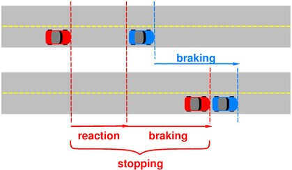
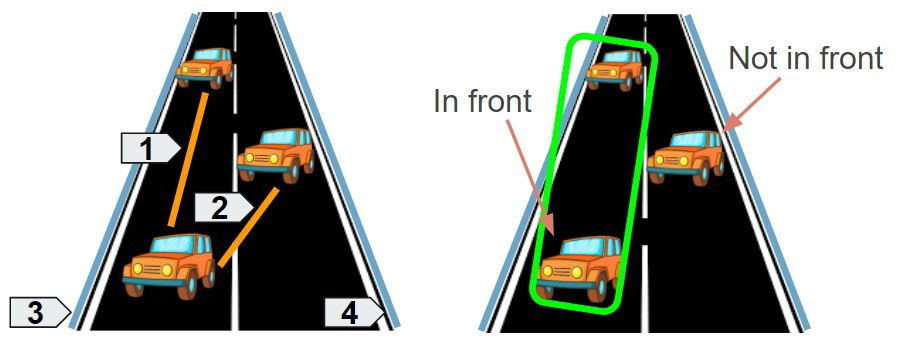
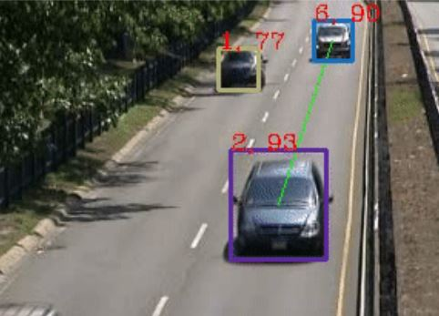

# Video Surveillance for Road Traffic Monitoring
Master in Computer Vision - M6 Video Analysis

## Group 06
Name: Group 06 
Juan Felipe Montesinos(jfmontgar@gmail.com)  
Ferran Carrasquer(ferrancarrasquer@gmail.com)  
Yi Xiao(yi.xiao@e-campus.uab.cat)  

## Resources  

* [Project slides](https://docs.google.com/presentation/d/1cTuS8FWgHuhoUesjBXL4naTedBy3lkAg0gWeuaF_pgo/edit?usp=sharing)  
* [Project codes](https://github.com/mcv-m6-video/mcv-m6-2018-team6)  
* [Project Paper](https://github.com/mcv-m6-video/mcv-m6-2018-team6/blob/master/m6-final-report.pdf)  

## Motivation   
The goal of this 5-week project is to learn the basic concepts and techniques related to video sequences processing, mainly for surveillance applications. Traffic accident is one of the common cause of death in the world, an effective survillance is necessary in traffic. Computer Vision can be a very useful and affordable way in this field which can assist to improve the traffic safety. We have proposed a video surveillance system which is able to track vehicles passing by the road and predict their speeds. In addition, we extended our system as a Collision Detector for a better usage in Traffic System.  

## Vehicle Tracking  

* Kalman filter   

Kalman filter is an optimal method in case of a linear dynamic model with gaussian noise. Having any uncertain information about a dynamic system, an educated guess about what the system is going to do next can be made. It has many uses, including applications in control, navigation, computer vision, and time series econometrics.  

Since Kalman Filter should be implemented after object detection, background subtraction has been performed firstly. A function from OpenCV which is based on gaussian mixture algorithm can be used. It selects the appropriate number of gaussian distribution for each pixel, and provides good adaptability to varying scenes due illumination changes. You can see an example of the result frame after background subtraction as below:  

   

After background subtraction, the main idea next is to find out the centroids of the objects which indicate the positions of the cars, and take them as the input of the kalman filter. For each frame, the steps can be summarized as below:  

* Detect tracks and obtain centroids and bounding box;  
* Create tracks and assign track ID;  
* Calculate cost between track prediction and detection;  
* Use Hungarian Algorithm determine and assign every detected cars to correct track ID;  
* Maintain tracks and handle unassigned track predictions and detections;  
* Apply Kalman Filter to predict and update tracks.  
 
   

The result of Kalman Filter tracking was not as good as we expected, since the object detection and foreground segmentation were not good enough, resulting in a bad tracking. The tracker did not stay for many frames and the Object detection was not stable. With this thinking, a new approach based on Deep Learning has been tried in next section to perform a better object detection for cars tracking.  

* Deep Learning (RNN YOLO v2)  

## Speed Estimation  

## Collision Detector

Once the velocity of a car can be determined by means of computer vision techniques, we implement our own case study focused on evaluating the risk of collision from 2 different cars on the road, one in front the other. 
For computing the stopping distance of a car it is based on a study where it is introduced that: stopping distance = reaction distance + breaking distance. While the reaction distance can be approximate as a 0.5 times the current velocity at x time, the breaking distance can be approximated using the Newton's laws of motion, where the cinematic energy that the car has is going to be transformed to the friction between the tires and the road.

Once the stopping distance is known, it is necessary to set which of the cars from the scene are going to be evaluated in function of their position and driving lane. For doing so, it is proposed a method to know when two cars are one in front of the other based on the parallelism between the lines that connect each pair of cars and the contour lines of the road.

Following what before mentioned, plotting the lines between cars such as the orange ones(1 and 2) in the previous figure, those can be studied by computing the angle between 1 and 3, 1 and 4, 2 and 3, and 2 and 4. After this, if some of the combinations have an angle below than a given threshold (similar to 30) those lines are parallel and the stopping distance is evaluated. From the figure, this would be extrapolated to evaluate the case of the line '1' due is the only orange line parallel to some of the blue lines, the 1 parallel with the 3.

Once the two cars are selected it is studied if the distance between these two cars is shorter than the stopping distance and it is plotted a color line between these 2 cars with the legend of green, orange and red corresponding to the degree of danger. As shown in the following figure, the distance between the two co-linear cars is safe (larger than the stopping distance) and therefore a green line is plotted between these two cars.

## Conclusions and Future Work

A first approach was based on kalman filter after the foreground segmentation was done. To make the system more robust we proposed a method based on detecting the cars with a pre-trained Neural Network over the frames. Furthermore, a collision detector was performed in order to asses when the distance between two cars was smaller than the stopping distance and therefore there was a high risk of collision if the car in front stops suddenly.

On the other hand, there are some parts of the system that could be improved. The first one is to train a Neural Network taking into account the time dimension of each car detected, another improvement could be related to computing the velocity of the cars since when doing the projective rectification the results of 2 different cars with the same GT velocity can differ depending on the shape of those. Finally it could be improved the decision of the cars to study for the risk of collision detecting each line road over the video based on the white lines of the road.
