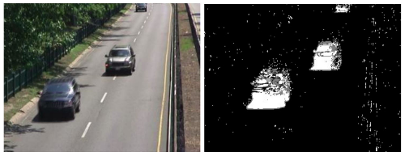
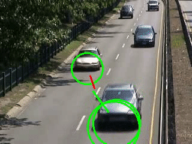

# Video Surveillance for Road Traffic Monitoring
Master in Computer Vision - M6 Visual Analysis

## Group 06
Name: Group 06 
Juan Felipe Montesinos(jfmontgar@gmail.com)  
Ferran Carrasquer(ferrancarrasquer@gmail.com)  
Yi Xiao(yi.xiao@e-campus.uab.cat)  

## Resources  

* [Project slides](https://docs.google.com/presentation/d/1cTuS8FWgHuhoUesjBXL4naTedBy3lkAg0gWeuaF_pgo/edit?usp=sharing)  
* [Project codes](https://github.com/mcv-m6-video/mcv-m6-2018-team6)  
* [Project Paper](https://github.com/mcv-m6-video/mcv-m6-2018-team6/blob/master/m6-final-report.pdf)  

## Motivation   
The goal of this 5-week project is to learn the basic concepts and techniques related to video sequences processing, mainly for surveillance applications. Traffic accident is one of the common cause of death in the world, an effective survillance is necessary in traffic. Computer Vision can be a very useful and affordable way in this field which can assist to improve the traffic safety. We have proposed a video surveillance system which is able to track vehicles passing by the road and predict their speeds. In addition, we extended our system as a Collision Detector for a better usage in Traffic System.  

## Vehicle Tracking  

* Kalman filter   

Kalman filter is an optimal method in case of a linear dynamic model with gaussian noise. Having any uncertain information about a dynamic system, an educated guess about what the system is going to do next can be made. It has many uses, including applications in control, navigation, computer vision, and time series econometrics.  

Since Kalman Filter should be implemented after object detection, background subtraction has been performed firstly. A function from OpenCV which is based on gaussian mixture algorithm can be used. It selects the appropriate number of gaussian distribution for each pixel, and provides good adaptability to varying scenes due illumination changes. You can see an example of the result frame after background subtraction as below:  

   

After background subtraction, the main idea next is to find out the centroids of the objects which indicate the positions of the cars, and take them as the input of the kalman filter. For each frame, the steps can be summarized as below:  

* Detect tracks and obtain centroids and bounding box;  
* Create tracks and assign track ID;  
* Calculate cost between track prediction and detection;  
* Use Hungarian Algorithm determine and assign every detected cars to correct track ID;  
* Maintain tracks and handle unassigned track predictions and detections;  
* Apply Kalman Filter to predict and update tracks.  
 
   

The result of Kalman Filter tracking was not as good as we expected, since the object detection and foreground segmentation were not good enough, resulting in a bad tracking. The tracker did not stay for many frames and the Object detection was not stable. With this thinking, a new approach based on Deep Learning has been tried in next section to perform a better object detection for cars tracking.  

* Deep Learning (RNN YOLO v2)  

## Speed Estimation  

## Collision Detector

