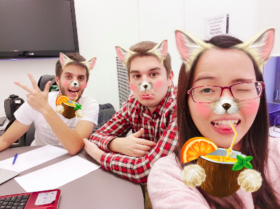
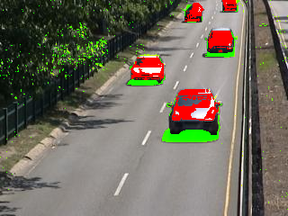
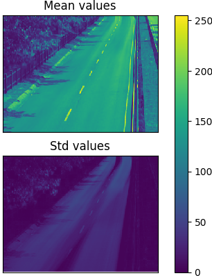

# Video Surveillance for Road Traffic Monitoring
Master in Computer Vision - M6 Visual Analysis

## Group 06
Name: Group 06 
Juan Felipe Montesinos(jfmontgar@gmail.com)  
Ferran Carrasquer(ferrancarrasquer@gmail.com)  
Yi Xiao(yi.xiao@e-campus.uab.cat)  

+

## Abstract   
The goal of this 5-week project is to learn the basic concepts and techniques related to video sequences processing, mainly for surveillance applications.

## Framework structure
Framework is OOP-based.  
* Each motion estimation algorith is coded as a inheritance class.
* Each class has specific methods to model background, evaluate, plot and run estimations.

### Main class
All the classes have the following attributes:

name: [str] Brief description up to you. For example dataset name.  
im_dir: [str] Frame's folder directory  
gt_dir: [str] Groundtruth's folder directory  
color: [str] [default='gray'] Using greyscale 'gray', RGB 'RGB' or HSV 'HSV' colorspace

Methods

* **animacion(frame_list)**
Creates a .gif file animating given a list of frames stored in im_dir directory. Displaying anamation of results from errorPainting.  
  
* **errorPainting(frame_list,gt_list,results_list_dir)**
Visualize False Positives and False Negatives for a set a given frames, comparing given results with groundtruth. Red represents False Negative and green represents false positive.
  
*frame_list* list containing names of each frame. These frames are supossed to be stored in im_dir folder.  
*gt_list:* list containing names of each groundtruth. These gt are supossed to be stored in gt_dir folder.  
***results_list_dir*** list containing **FULL DIRECTORY+NAME+FORMAT**(.png ie) of binary results to be compared with groundtruth.  

### gaussian1D
This class allows to perform a gaussian-based motion estimation. One gaussian (mean,std) per pixel is computed

Aditional attributes:  
mean: MxN(xc if color) numpy array which contains mean per pixel (per channel)  
std:  MxN(xc) numpy array which contains std per pixel (per channel)  

Methods:  
* **get_1D(frame_list)**
Compute gaussian for every pixel in every channel and store them in the mean-std attributes.

*frame_list:* list containing names of each frame which will be used to compute the gaussian background model. These frames
are supossed to be stored in im_dir folder

* **get_motion(im,th)**
Computes probabilistic motion estimation for a given image (im) using the model saved in the instance.  
*im:* [cvMat] RGB Image opened with cv2.imread procedure.  
*th:* [numerical] threshold for tunning probability of being motion.  
		if |Pixeli-MEANi|> (std+2)*th 

* **evaluateSeveralFrames(frame_list,gt_list)**
Return precision, recall and F1 values for a set of frames (absolute values, not averaging frames)

*frame_list:* list containing names of each frame which will be used to compute the evaluation. These frames
are supossed to be stored in im_dir folder.  
*gt_list:* list containing names of each groundtruth which will be used to compute the evaluation. These gt
are supossed to be stored in gt_dir folder.  

Note: frames and their related grountruth images MUST share the same position in their respective lists.

* **allvsalpha(frame_list,gt_list,th_lindspace)**
Saves precision, recall and F1 vs alpha in class attributes.  
*frame_list:* list containing names of each frame which will be used to compute the evaluation. These frames
are supossed to be stored in im_dir folder.  
*gt_list:* list containing names of each groundtruth which will be used to compute the evaluation. These gt
are supossed to be stored in gt_dir folder.  
*th_lindspace:* Vector of different alphas to perform allvsalpha

* **saveAllvsalpha()**
Save in txt files precision, recall, F1 values. Textfile names are predefined according to instance name:  
name + {_F1.txt,_precision.txt,_recall.txt}. Files saved in directory of work.

* **LoadAllvsalpha()**
Load textfiles saved with *saveAllvsalpha()* function. Files are supposed to be stored at directory of work.
* **PlotMeanStd()**
Visualize mean and std modeled in a single graphic as the following one:  
+

### MOG
This class allows to perform a predifined GMM (5 mixtures).  
* **get_1D(frame_list)**
Compute gaussian for every pixel in every channel and store them in the mean-std attributes.  

* **get_motion(im,th)**
*frame_list:* list containing names of each frame which will be used to compute the gaussian background model. These frames
are supossed to be stored in im_dir folder  

* **evaluateSeveralFrames(frame_list,gt_list)**
Return precision, recall and F1 values for a set of frames (absolute values, not averaging frames)

*frame_list:* list containing names of each frame which will be used to compute the evaluation. These frames
are supossed to be stored in im_dir folder.  
*gt_list:* list containing names of each groundtruth which will be used to compute the evaluation. These gt
are supossed to be stored in gt_dir folder.  

Note: frames and their related grountruth images MUST share the same position in their respective lists.
Computes probabilistic motion estimation for a given image (im) using the model saved in the instance.  
*im:* [cvMat] RGB Image opened with cv2.imread procedure.  

### adaptative
Only available as grayscale.  
**All gaussian1D functions available**
Computes an adaptative model the same way as gaussian1D but updating mean and std.  
+
* **allvsalpha(frame_list,gt_list,alpha_lindspace,beta_lindspace)**
Saves precision, recall and F1 vs alpha in class attributes.  
*frame_list:* list containing names of each frame which will be used to compute the evaluation. These frames
are supossed to be stored in im_dir folder.  
*gt_list:* list containing names of each groundtruth which will be used to compute the evaluation. These gt
are supossed to be stored in gt_dir folder.  
*alpha_lindspace:* Vector of different alphas to perform allvsalpha  
*beta_lindspace:* Vector of different betas to perform allvsalpha  
